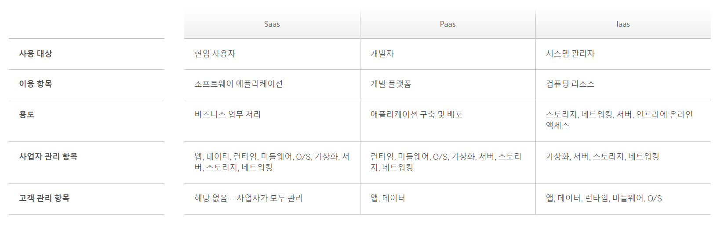

## 클라우드 컴퓨팅(Cloud Computing)

> 클라우드 컴퓨팅은 IT 리소스를 인터넷을 통해 [온디맨드](https://yslab.kr/63)로 제공하고 사용한 만큼만 비용을 지불하는 것을 말한다.   
> 물리적 데이터 센터와 서버를 구입, 소유 및 비용을 지불하는 것을 말합니다. 물리적 데이터 센터와 서버를 구입,소유 및 유지 관리하는 대신   
> Amazom Web Service(AWS)와 같은 클라우드 공급자로 부터 필요에 따라 컴퓨팅 파워, 스토리지, 데이터베이스와 같은 기술 서비스에 액세스 할 수 있다.   
> https://aws.amazon.com/ko/what-is-cloud-computing/ - 아마존 페이지 참조   

### 클라우드 기술이란?
클라우드 컴퓨팅은 인터넷을 통해 구독 기반의 데이터 스토리지, 보안, 네트워킹, 소프트웨어 애플리케이션 및 비즈니스 인텔리전스와 같은 서비스를 제공합니다.   

### 클라우드 컴퓨팅의 이점
- 신뢰성:
  >보안에 강하고 안전하며 언제든 이용할 수 있습니다.   
  >클라우드 시스템에는 빠른 응답 시간으로 언제 어디서나 액세스할 수 있습니다.   
  >풀타임 보안 전문가들이 관리하는 안전한 서버에서 운영됩니다.   
  >데이터가 중복되거나 원격으로 백업되었는지 파악할 수 있습니다.   
- 우연성
  > 필요할 때 필요한 만큼 컴퓨팅 능력을 확보할 수 있습니다.    
  > 서버, 네트워킹, 스토리지를 추가 또는 제거할 수 있습니다.    
  > 새로운 사용자를 즉각 온보딩할 수 있습니다. 새로운 지역으로 확장할 수 있습니다.    
  > 이 모든 과정이 빠르고 손쉽게 이루어집니다.   
- 경제성
  >  필요한 만큼만 지불하면 됩니다.    
  > 하드웨어나 시설에 대한 초기 금융 비용이 필요하지 않습니다.    
  > IT 직원이 시스템을 유지보수하고 업그레이드하는 데 쓰는 시간을 줄여줍니다.    
  > 대신 매출을 창출하는 프로젝트에 자금과 인력을 투자할 수 있습니다.   
- 최신 상태 유지
  > 플랫폼, 데이터베이스, 소프트웨어 애플리케이션을 언제나 최신 버전으로 유지할 수 있습니다.    
  > 또한, 머신러닝(ML), 인공지능(AI), 사물인터넷(IoT) 등 새롭게 부상하는 기술을 활용합니다.    
  > 언제나 가장 최근의 혁신을 최신 상태로 반영합니다.   

### 클라우드 컴퓨팅 서비스의 유형
클라우드 컴퓨팅은 SaaS, PaaS, IaaS의 세 가지 주요 서비스 부문으로 나뉩니다.   
이 세 가지 서비스를 결합해 제공하는 업체도 있는 반면, 각각 별도로 제공하는 업체도 있습니다.

클라우드 컴퓨팅의 세 가지 서비스 유형을 소개합니다.   

- ### SaaS란?
  > 서비스형 소프트웨어(Software-as-a-Service, SaaS) 유형의 소프트웨어는 원격 서버에 호스팅됩니다.    
  > 고객은 웹 브라우저나 표준 웹 통합을 통해 언제 어디서나 소프트웨어에 액세스할 수 있습니다.    
  > SaaS 사업자는 백업, 유지보수, 업데이트를 관리합니다.    
  > SaaS 솔루션에는 전사적 자원 관리(ERP), 고객 관계 관리(CRM), 프로젝트 관리 등이 포함됩니다.   
  
- ### PaaS란?
  > 서비스형 플랫폼(Platform-as-a-Service, PaaS)은 클라우드 기반의 애플리케이션 개발 환경으로,    
  > 개발자가 앱을 구축하고 배포하는 데 필요한 모든 요소를 제공합니다.    
  > PaaS를 이용하는 개발자는 원하는 기능과 클라우드 서비스를 선택할 수 있으며,    
  > 구독 또는 종량제(pay-per-use) 방식으로 비용을 지불합니다.

- ### IaaS란?
  > 서비스형 인프라(Infrastructure-as-a-Service, IaaS)를 도입하면 회사에서 서버, 네트워크, 스토리지, 운영 체제와 같은 컴퓨팅 리소스를 종량제로 '임대'할 수 있습니다.   
  > 인프라의 규모를 확장할 수 있으므로 고객은 하드웨어에 투자할 필요가 없습니다.   

## IaaS vs PaaS vs SaaS
SaaS, PaaS, IaaS를 비교해 각 '서비스형' 모델에서 기대할 수 있는 점이 무엇인지 확인해보세요.   
현재 대부분의 기업은 세 가지 모델을 결합해 사용하고 있기 때문에 각 모델 간의 경계가 모호할 수 있습니다.   

