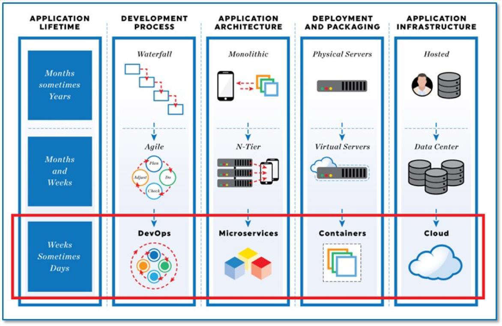

# 소프트웨어 아키텍처의 성장 여정

> Main-Frame -> Client/Server -> Web -> SOA -> REST

- Main-Frame : 메인프레임 또는 대형 컴퓨터는 통계 데이터나 금융관련 전산업무, 전사적 자원관리와 같이 복잡한 작업을 처리하는 컴퓨터
- Client/Server: 서비스 요청자인 클라이언트와 서비스 자원의 제공자인 서버 간에 작업을 분리해주는 분산 애플리케이션 구조이자 네트워크 아키텍처를 나타낸다
- Web: HTTP 프로토콜 상에서 여러 다중의 서비스를 연결해주는 하나의 서비스 WWW 또는 W3 라고 칭한다.
- SOA: 서비스 지향 아키텍처(SOA)는 네트워크에서 공통의 통신 언어를 사용하는 서비스 인터페이스를 활용하여 소프트웨어 구성요소를 다시 사용할 수 있게 만드는 소프트웨어 설계 유형
- REST:  REST는 네트워크 아키텍처 원리의 모음이다. 여기서 '네트워크 아키텍처 원리'란 자원을 정의하고 자원에 대한 주소를 지정하는 방법 전반을 일컫는다. 

## AGILE의 정의
빠른 실패를 많이 하므로써 고객의 needs를 분석하기 보다는 잦은 배포와 잦은 개발로 고객의 needs를 맞춰 나가는 기법   
고객의 반응을 살피면서 완성도를 높여가는 방법

### 애자일에 필요한 것들

- <strong style="font-size:16px">폭포수 방법론</strong>: 소프트웨어 개발 단계가 위에서 부터 아래로 폭포에서 물이 떨어지듯이 순차적으로 진행한다. 폭포수 방법론은 한단계씩 진행함에 따라 다시 이전 단계로 가지 않고 계속 진행하기에 다음 단계로 가기전에 완벽하게 요구사항을 반영하여 개발한다.
  - ### 장점:
    - 수직적 진행되기에 각 과정에 대한 이해가 용이하다
  - ### 단점
      - 수직적으로 진행되기 때문에 개발 도중에 요구사항이 변경되었을 경우, 추가적인 비용과 시간이 들게된다.
- <strong style="font-size:16px">애자일 방법론</strong>: 폭포수와는 다르게 소프트웨어 개발 단계를 명확하게 구분하지 않고 각 단계를 반복적으로 수행하면서 진행 이때 요구사항을 추가하거나 제거하면서 진행
  - ### 장점:
    - 개발 도중에 요구사항이 변경되었을 경우, 해당 요구 사항을 반영하기 용이
    - 개발 하면서 지속적으로 테스트 되기에 개발 초기에 버그를 발견할 수 있다.
  - ### 단점:
    - 폭포수방법론에 비해 체계화된 문서가 적을 수 있다.
- <strong style="font-size:16px">데브옵스</strong>:개발과 운영을 결합해 탄생한 개발 방법론 시스탬 개발자와 운영 담당하는 정보기술 전문가 사이의 소통,협업,통합및 자동화를 강조하는 소프트웨어 개발 방법론
  - ### 장점:
    - 개발과 운영간의 의사소통 증가로 생산성 증대
    - 한곳에서 개발부터 검증, 배포까지 전체를 담당하게되어 개발과 배포 속도가 빨라짐
    - 구성원에게 개발 책임감과 코드의 소유권을 높여줘 개발 프로세스 간소화
  - ### 단점:
    - 다양한 팀이 모여 업무 역활이 변경되기 때문에 활성화되기 위해서는 충분한 시간이 필요하다
    - 코드를 자주 배포할 필요가 없다면 비용만 늘어난다
    - 포괄적인 자동화 도구가 필요하다
- <strong style="font-size:16px">모노리스 아키텍처</strong>: 마이크로 아키텍처의 반대되는 개념으로 전통의 아키텍처를 지칭하는 의미로 생겨난 단어 하나의 서비스 또는 애플리케이션이 하나의 거대한 아키텍처를 ㄱ
