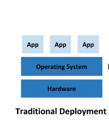
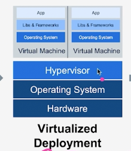
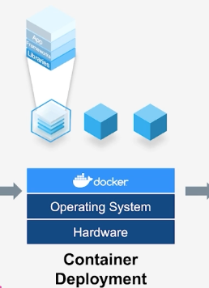
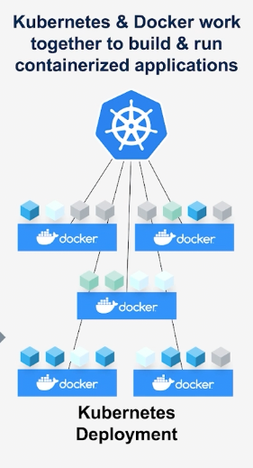

# 개요
## 컨테이너 기술의 발전

먼저 이 사항을 이해 할려면 기업들이 어떻게 서비스를 효울적으로 운영할 것인가?
라는 문제를 어떻게 풀어 갔는지 이해를 해야 한다

컨테이너 기반의 서비스 배포가 나오기 전에는 모든 기업들은    

Traditional Deployment라는 방법을 사용하여 서비스를 운영했다   
   
> Traditional Deployment(전통적인 배포 시대)   
> 초기 조직은 애플리케이션을 물리 서버에서 실행했었는데 한 물리서버에서 여러 애플리케이션의 
> 리소스 한계를 정의할 방법이 없었기에 리소스 할당의 문제가 발생했다. 예를 들어 물리 서버 하나에서
> 여러 애플리케이션을 실행한다면 리소스 전부를 차지하는 애플리케이션 인스턴스가 있을수 있고
> 결과적으로 다른 애플리케이션의 성능이 저하될 수 있었다
> 
> 이에 대한 해결책으로 서로 다른 여러 물리 서버에서 각 애플리케이션을 실행하는 방법이 있으나
> 이는 리소스가 충분히 활용되지 않는다는 점에서 확장 가능하지 않기에 물리 서버를 유지하기 위한 많은 비용이 들었다

이 위 같은 상황에서 기업들은 이 서비스 운영을 어떻게 해야 컴퓨팅 자원을 최대한 잘 쓸 수 있을까? 라는 고민을 하게 되었다

한 컴퓨터 안에 여러개의 서비스를 돌리고 싶었지만 한 서비스가 필요한 라이브러리에 공유 라이브러리가 같은 라이브러리에 버전만 다른
라이브러리를 사용한다면 컴퓨터는 한 버전의 라이브러리만 사용을 허용한다

이이 기업들은 어떻게 한 하드웨어에서 각각의 App들을 독립적으로 실행할 수 있는가..를 생각 하게 되었

이 상황에 이르자 기업들은 가상화 머신을 개발하게 되었다

### Virtualized Deployment

#### Virtual Machin
- 가상화를 사용하면 단일 물리적 서버에서 여러 VM을 실행할 수 있습니다
- 각 VM에는 운영 체제, 애플리케이션, 필요한 바이너리 및 라이브러리의 전체 복사본이 포함됩니다.
- 가상화를 통해 확장성 문제를 해결하는 애플리케이션을 더 쉽게 추가하고 업데이트할 수 있습니다
- 가상화를 통해 리소스 활용도를 높일 수 있습니다.
- 가상화는 VM 간에 애플리케이션을 격리합니다.

#### Virtual Machine is great but there are a few problems.
- 운영 체제 이미지는 GB 단위의 헤비급 이미지 크기입니다.
- 각 가상 머신에 대한 게스트 OS를 포함합니다.
- 부팅 속도가 느린 프로세스입니다.
- 응용 프로그램은 이식 가능하지 않습니다
- 요구 사항에 따라 확장할 수 없습니다.
- 가상 머신을 가동하는 데 1-2분이 소요될 수 있습니다.

### Container Deployment

#### Docker Container
- 운영 체제를 가상화하는 프로세스는 컨테이너를 생성합니다.
- 컨테이너는 코드와 종속성을 함께 패키징하는 OS 계층의 추상화입니다.
- 컨테이너는 VM보다 공간을 덜 차지하며 빠르게 부팅됩니다.
- 컨테이너는 기본 하드웨어를 사용하므로 리소스 낭비가 없습니다.
- 컨테이너는 매우 가볍고 매우 빠르며 몇 초 또는 몇 밀리초까지 회전할 수 있습니다.
- Docker 컨테이너는 프로세스가 격리되어 있으며 하드웨어 하이퍼바이저가 필요하지 않습니다.
- 컨테이너는 휴대성이 뛰어납니다.
- 컨테이너는 도커 컨테이너를 만들고 관리하는 데 도움이 되는 Kubernetes 또는 Docker Swarm과 같은 오케스트레이션 플랫폼의 도움으로 확장성이 뛰어납니다.

#### container Deployment 단점
- 컨테아너 개발자 찾기가 어렵다
- 엉성한 컨테이너 아키텍처
- 컨테이너는 예상보다 비용이 더 든다.

### Kubernetes Deployment

container orchestration system   
[컨테이너 오케스트레이션 설명](https://www.redhat.com/ko/topics/containers/what-is-container-orchestration)
유일한 시스템은 아니며 처음 만들어진 시스템도 아니다 다만 쿠버네티스가 사실상 가장 멀리 사용되어지고 있는 시스템이다
