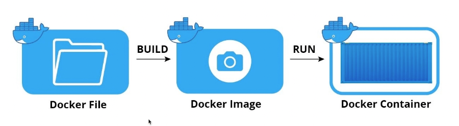

# 도커 이미지와 컨테이너
이미지와 컨테이너는 도커에서 사용하는 가장 기본적인 단위이다

이미지와 컨테이너는 1:N 관계

이미지(Image)
이미지는 컨테이너를 생성할 떄 필요한 요소로 컨테이너의 목적에 맞는 바이너리와 의존성이 설치되어 있음
여러 개의 계층으로 된 바이너리 파일로 존재

컨테이너(Container)
호스트와 다른 컨테이너로부터 격리된 시스템자원과 네트워크를 사용하는 프로세스 이미지는 읽기 전용으로 사용하여 변경사항은 컨테이너 계층에 저장   
=> 컨테이너에서 무엇을 하든 이미지는 영향을 받지 않음

### 도커가 서비스를 실행하는 방법

Docker File (빌드)-> Docker Image (Run)-> Docker Container   
이미지(Image) Vs 컨테이너(container)   
프로그램(Program) Vs 프로세스(Process)   
클래스(Class) Vs 인스턴스(Instance)

### 도커 이미지 이름 구성
- 저장소 이름(Repository Name)
- 이미지 이름(Image Name)
- 이미지 태그(Image Tag)

연습시 사용할 저장소 이름
- fastcampus/ngnix
- fastcampus/nginx:1.21
- nginx:latst
- nginsx

도커 이미지 Pull/Push 시에 저장소 이름은 생략하면 기본 저장소인 도커 허브로 인식   
도커 이미지 태그를 생략하면 최신 리비전을 가리키는 lastest로 인식

### 도커 이미지 저장소

이미지 저장소 (Image Repository)
도커 이미지를 관리하고 공유하기 위한 서버 어플리케이

#### 공개형
- docker hub
- Quay

#### 비공개형
- AWS ECR
- Docker Registry

