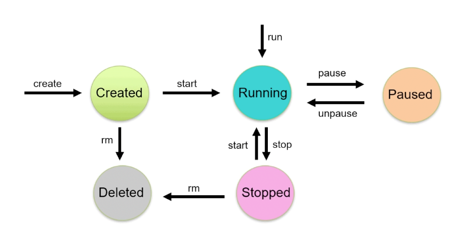
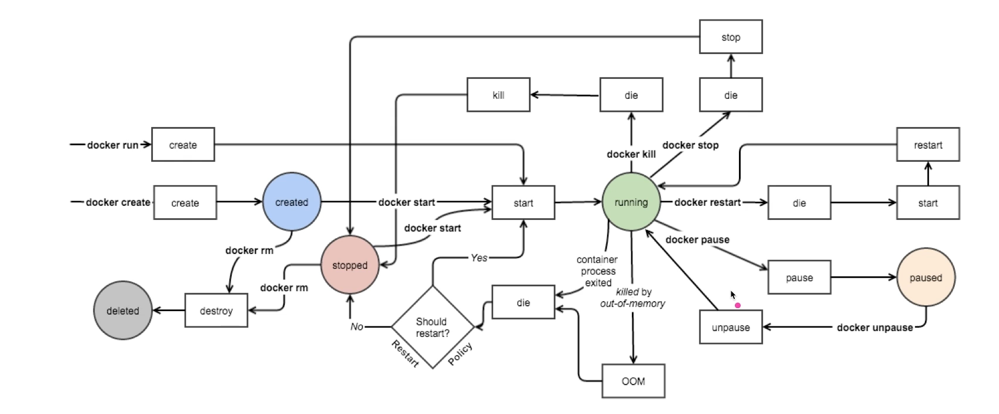
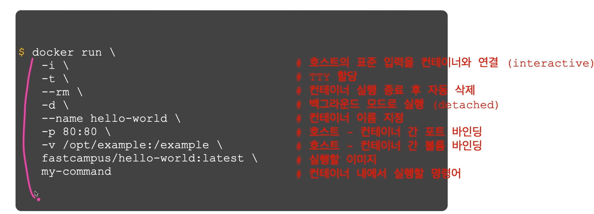
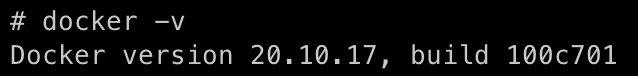
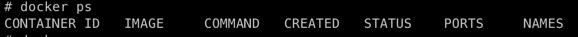
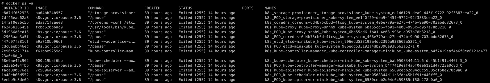
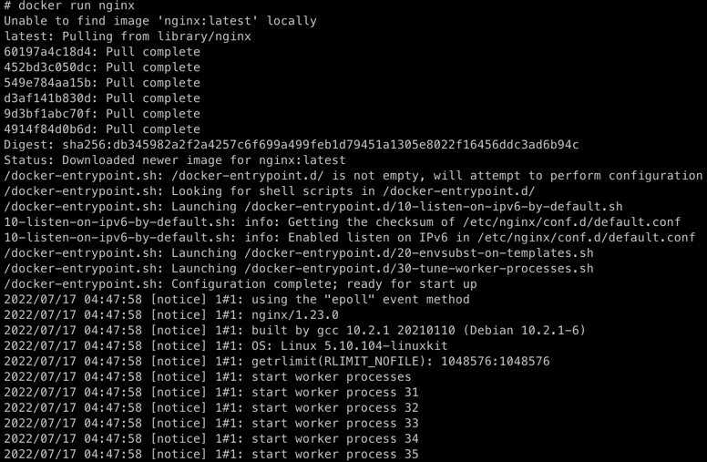

# 도커 컨테이너 라이프사이클

### 상세 라이프 사이클

### 컨테이너 시작

도커 create/ run 명령어 모두 이미지가 없을 경우 자동으로 pull을 먼저 수행하여 이미지를 다운로드 받음

#### 컨테이너 생성
> docker create \[imaage]\

#### 컨테이너 시작
> docker start \[contaier]

#### 컨테이너 생성 및 시작
> docker run image

### 컨테이너 시작 주요 옵션

### 예시

- #### 도커 버전 확인하기
    
    ~~~
     docker -v
    ~~~
    
    위 코드를 입력시 현재 돌아가고 있는 도커의 버전을 확인 할 수 있다.

- #### 현재 실행되고 있는 컨테이너 항목 확인하기
  ~~~
    docker ps
  ~~~
  
    
  현재는 아무것도 실행이 되지 않고 있기 때문에 출력되지 않는다

- #### 모든 실행됐던 컨테이너 표시하기

 ~~~
    docker ps -a
 ~~~
 위 코드를 실행하면 내가 사용하고 종료됐던 모든 컨테이너를 표시한다.
 
 
 위 같이 실행되었던 모든 컨테이너를 확인 가능하다.

그럼 도커를 시작을 해보도록 하겠다

~~~
docker run nginx
~~~
가장 많이 쓰고 있는 이미지인 nginx를 실행해 보도록 하겠다.

로컬에 없는 이미지는 도커가 자체적으로 pull을 해와 설치한다.

