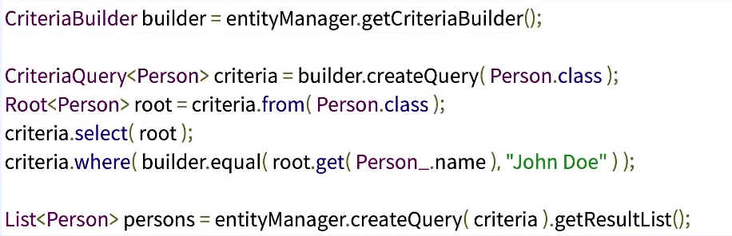

## 하이버네이트? 스프링 JPA?
둘다 Spring Data JPA를 사용하면서 볼 수 있는 단어들
- 정확히 무슨 차이인지 알아보자

------

## Hibernate
"MORE THAN ORM, DISCOVER THE HIBERNATE GALAXY"
- 자바생태계 대표하는 ORM framework
- 스프링 부트에서 채택한 메인 ORM framework
- JPA 표준 스펙을 구현한 JPA Provider
- 고성능, 확장성, 안정성을 표방
- 다양한 하위 제품들로 나뉨
  - Hibernate ORM (최신: 5.5,스프링 부트: 5.4.32)
  - Hibernate Validator
  - Hibernate Reactive
# Hibernate:HQL
## Hibernate Query Language
하이버네이트가 사용하는 SQL 스타일 비표준 쿼리 언어
- 객체 모델에 초점을 맞춰 설계됨
- JPQL의 바탕이 됨(JPQL은 HQL의 subset)
  - JPQL은 완벽한 HQL문장이지만. 반대로는 성립하지 않음

# Hibernate:Criteria

## Criteria query
type - safety를 제공하는 JPQL의 대안 표현법

## Persistence.xml

## Entitiy Class

## Logic

# Spring Data JPA

## spirng Data JPA
스프링에서 제공하는 JPA 추상화 모듈
- JPA 구현체의 사용을 한 번더, Repository라는 개념으로 추상화
- JPA 구현체의 사용을 감추고, 다양한 지원과 설정 방법을 제공
- JPA 기본 구현체로 Hibernate사용
- Querydsl 지원

# Spring Data JPA 사용하면서 알아야 할 사실
## Spring Data JPA를 사용한다면
JPA, 하이버네이트를 몰라도 되어야 한다.
- EntitiyManager를 직접 사용하지 않는다.
- JPQL을 직접 사용하지 않는다.
- persist(), merge(), close()를 직접 사용하지 않는다.
- 트랜잭션을 getTransaction(), commit(), rollback().으로 관리하지 않는다.
- 코드가 하이버네이트를 직접 사용하고 있다면
  - 꼭 필요한 코드인지, 아니면 Spring Data JPA로 할 수 있는 일인지 확인해라
  - 그 코드는 하이버네이트와 직접적인 연관 관계를 가지게 된다.
  - 추상화의 이점을 포기하게 되는 셈이다.