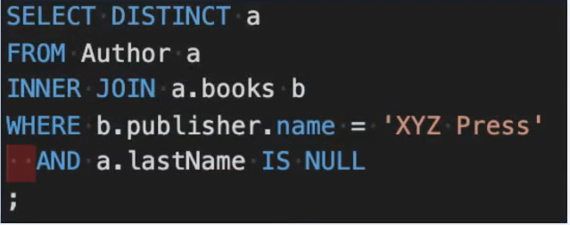
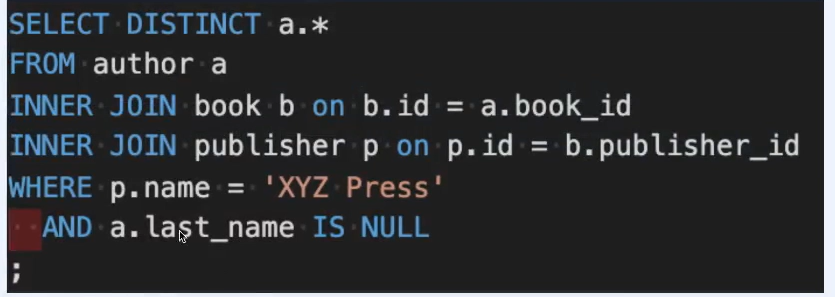

# ORM, JPA, JPQL 개요

## Spring DATA JPA를 시작하기 전에...
정확한 개념을 세우고 들어가보자
- ORM?
- JPA?
- JPQL?

## ORM
### Object Relational Mapping
객체 지향 언어를 이용하여, 서로 호환되지 않는 타입 간의 데이터를 변환하는 기술
- 좁은 의미: DB(RDBMS)테이블 데이터를 (JAVA) 객체와 매핑하는 기술
- 효과: RDBMS를 객체 지향 DB로 가상화 하는것
- ORM 으로 얻고자 하는 것
  - DB의 추상화: 특정 DB에 종속된 표현(ex:SQL)이나 구현이 사라지고, DB변경에 좀더 유연해짐
  - 갹체의 이점을 활용: 객체간 참조, type-safety
  - 관심사 분리: DB동작에 관한 코드 작성의 반복을 최소화하고 비즈니스 로직에 집중

## JPA
### Jakarta(Java) Persistence API
자바에서 ORM 기술을 사용해 RDBMS를 다루기 위한 인터페이스 표준 명세
- API + JPQL + metadata(+ Criteria API)
- 기본적으로 관계형 데이터베이스의 영속성(persistence)만을 규정
  - JPA 구현체 중에 다른 유형의 데이터베이스 모델을 지원하는 경우가 있지만, 원래 JPA스펙과는 무관 
- 이름의 변화
  - Java Persistence API -> Jakarta Persistence API
  - 2017년 9월, 오라클이 Java EE를 이클립스 재단으로 이관 -> 상표권 문제로 이름을 변경
  - Spring Boot: 2.2부터 Jakarta EE 로 의존성이 변경됨
    - 현제: JPA 2.2.3(패키지명은 아직 javax.persistence.*)
    - 미래: JPA3.0이 도입되면서 패키지명이 완전히 jakarta.persistence.*로 변경될 전망

## JPA:Persistence
### Persistence (영속성)
프로세스가 만든 시스템의 상태가 종료된 후에도 사라지지 않는 특성
- 구현방법: 시스템의 상태를 데이터 저장소에 데이터로 저장한다.
- 사라지는 데이터 - 주기억장치(휘발성 스토리지 )에 저장된 데이터
  - 프로세스 메모리 안의 데이터(변수, 상수, 객체, 함수 등) Ex: 램카드
- 사라지지 않는 데이터 - 보조기억장치(비휘발성 스토리지)에 저장된 데이터 
  - 하드디스크, SSD에 기록된 데이터(파일, 데이터베이스 등)
- 영속성 프레임워크: 영속성을 관리하는 부분을 persistence layer로 추상화하고, 이를 전담하는 프레임워크에게 관리를 위임
- JPA에서 persistence란: 프로세스가 DB로 부터 읽거나 DB에 저장한 정보의 특성

## JPQL
### Jakarta(Java) Persistence Query Language

플랫폼으로부터 독립적인 객체 지향 쿼리 언어
- JPA 표준의 일부로 정의됨
- RDBMS의 엔티티 (Entity)를 다루는 쿼리를 만드는데 사용
- SQL의 영향을 받아서 형식이 매우 유사

### JPQL VS. SQL(MySQL)

오른쪽은 우리가 잘 아는 MySQL의 한 쿼리 문이다 
살펴 보면 author이라는 테이블과 book 테이블을 조인 하고
또 book 테이블과 publisher 라는 다른 테이블을 조인 하며 
밑에는 조건이 붙어있다

이 문장을 JPQL 로 변경하면 왼쪽 그림 처럼 만들어 지는데

author 이라는 테이블이 아닌 Author이라는 객체를 만든다
이 객체 안에 a.book 아리는 Book 객첵가 포함된다는 걸 확인이 가능하다
또한 book 객체 안에 Publisher 라는 객체가 포함되어 Join역활을 대신 하는 걸 확인할 수 있다.
이렇게 간단히 표현이 가능하다

- SQL과 JPQL은 다른 언어이다.
  - SQL: 표준 ANSI SQL을 기준으로 만든, 특정 DB에 종속적인 언어
  - JPQL: 특정 DB에 종속적인 언어가 아니다
- JPA 프레임워크를 사용한다면
  - 특별한 요구사항이 있지 않은 한, JPQL을 몰라도 된다.
  - JPQL을 직접 사용하고 있다면 ,반드시 필요했던 일인지 검토하기