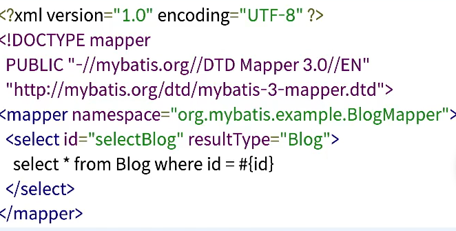

# IBATIS,My Batis,JdbcTemplate

## SQL Mapper
RBDMS 쿼리문의 실행 결과를 자바 코드에 매핑하는 프레임워크
- JDBC APU를 사용
- persistence framework
- 프로그램 코드와 SQL을 분리

## IBATIS
 ### Apache iBATIS
SQL 데이터베이스와 객체 간 매핑을 지원해주는 persistence framework
- 지원언어: Java, .NET ,Ruby
- SQL문을 별도의 XNL 문서로 작성하여 프로그램 코드와 분리한 형식
- 2001년 Clinton Begin이 개발 
- 2004년 iBATIS2.0릴리즈 - 아파치 소프트웨어 재단에 기증, 아파치에서 6년간 운영됨
- 2010년 iBATIS3.0릴리즈 - MyBatis로 개발 프로젝트 이동, 아파치 애틱(Attic) 프로젝트로 분류됨
- DAO 패턴이 발전하던 시기
  - Data Access Object 패턴 : 애플리케이션 비즈니스 레이어와 영속성 레이어를 추상화된 API를 이용하여 분리
  - DB접근 구현 클래스를 ~~~Dao라고 네이밍하는 관례가 많았던 시기
 

위 코드가 IBATIS로 만들어진 코드다 할고만 넘어가자

## MyBatis
- iBATIS 3.0에서 출발한 persistence framework(iBATIS랑 비교할 필요 없이 이거 쓰면 됨)
- 아직 썡썡히 살아있는 프로젝트
- 스프링, 스프링 부트와 연동을 지원
  - 스프링: org.mtbatis:mybatis-spring
  - 스프링 부트: org.mybatis.spring.boot:mybaits-spring-boot-stater
- 다양한 프레임워크와 연동을 지원
  - Freemarker, Velocity, Hazelcast, Memcached, Redis, Ignite, Guice
- ORM VS. MyBatis
  - ORM:자바 객체를 DB 테이블과 매핑
  - MyBatis: 자바 메소드를 SQL 실행 결과와 매핑   
  - 
MyBatis 구현 부분

자바 구현 부분

