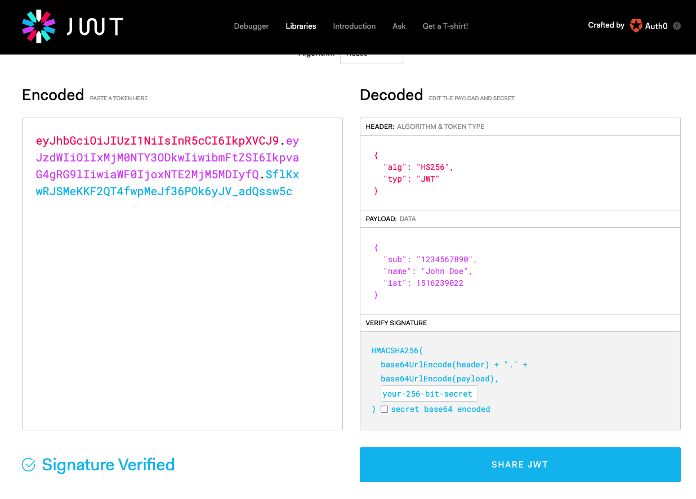

# JWT란?
서버에서 인증된 사용자가 인증을 유지해주는 방법으로 보통은 세션을 이옹한다.   
서버 세션을 사용하면 인증된 사용자는 매우 편리하게 서비스를 이용할 수 있고, 대부분의 웹 애플리케이션 서버가 세션을 지원하기 때문에 편리하다.   
하지만,   
- 서버를 여러대 둘 경우(scale out),
- 같은 사용자가 서로 다른 도메인의 데이터를 요청할 경우,(SSO)에는 세션을 유지하기 위한 비용이 매우 커지게 됩니다.

이 때는 서버에 사용자 정보를 저장하는 대신 클라이언트에 사용자 정보를 내려주고.   
서버는 토큰의 사용자 정보를 모든 요청에서 확인하고 서비스를 해주는 방식(sessionless)
일때,   
JWT 토큰이 매우 유용하게 사용된다.

JWT 자바 라이브러리는 보통 auth0.com에서 만든 java-jwt 라이브러리를 쓰거나 , okta 에서 만든 jjwt라이브러리를 사용한다.
- JWT 토큰 확인 : https://jwt.io/#debugger-io
- JWT : RFC7519 https://datatracker.ietf.org/doc/html/rfc7519
- JWS : RFC7515 https://datatracker.ietf.org/doc/html/rfc7515
- JWE : RFC7516 https://datatracker.ietf.org/doc/html/rfc7516

- JWT 토큰의 구조 : header + body + signature
- 구현 라이브러리
    - java-jwt : oauth0.io
    - jjwt : okta

그러면 토큰을 이용하면 세션은 이용 못하냐? 라고 한다면 답은 아니라고 할 수 있다
토큰을 사용하는 코드에도 세션을 만들어서 사용할 수 는 있다/

하지만 토큰을 사용하면 굳이 세션까지 사용해야 할 일은 발생하지 않는다.

세션(Session)   
정의: 일정 시간동안 같은 사용자(브라우저)로부터 들어오는   
일련의 요구를 하나의 상태로 보고,그 상태를 일정하게 유지시키는 기술   
여기서 일정 시간은 방문자가 웹 브라우저를 통해   
웹 서버에 접속한 시점으로부터 웹 브라우저를 종료하여 연결을 끝내는 시점을 말한다.   

- 세션 특징
    1. 웹 서버에 웹 컨테이너의 상태를 유지하기 위한 정보를 저장한다.
    2. 웹 서버의 저장되는 쿠키(=세션 쿠키)
    3. 브라우저를 닫거나, 서버에서 세션을 삭제했을때만 삭제가 되므로,   쿠키보다 비교적 보안이 좋다.
    4. 저장 데이터에 제한이 없다.(서버 용량이 허용하는 한...)
    5. 각 클라이언트 고유 Session ID를 부여한다.   Session ID로 클라이언트를 구분하여 각 클라이언트 요구에 맞는 서비스 제공

- 세션의 동작 순서
    1. 클라이언트가 페이지를 요청한다. (사용자가 웹사이트 접근)
    2. 서버는 접근한 클라이언트의 Request-Header 필드인 Cookie를 확인하여,   클라이언트가 해당 session-id를 보냈는지 확인한다.
    3. session-id가 존재하지 않는다면,   서버는 session-id를 생성해 클라이언트에게 돌려준다.
    4. 서버에서 클라이언트로 돌려준 session-id를 쿠키를 사용해 서버에 저장한다.   쿠키 이름 : JSESSIONID
    5. 클라이언트는 재접속 시,   이 쿠키(JSESSIONID)를 이용하여 session-id 값을 서버에 전달

## 세션(Session)과 토큰(Token)의 차이점
1. ### 사이즈
##### 세션 < 토큰
세션을 사용시 주고받는 session id의 크기는 매우 작습니다.
반면 (JWT기준) 토큰은 같은 데이터를 담고 있어도 그에 비해 크기가 크다
사실 이 차이점을 신경쓰고 쓰는 사람은 많지 않다

-----
2. ### 안전성
##### 세션
세션은 서버측에서 저장/관리하기 때문에 상대적으로 온전한 상태를 유지하기 유리하다
하지만 여전히 공격의 위험이 있기에 유효기간, HttpOnly,Secure 옵션 등을 주어 쿠키에 저장합니다.

##### 토큰
반대로 토큰은 웹 브라우저측(localStorage, 혹은 쿠키 등)에 저장되기 때문에 공격에 노출될 가능성이 더 크다
이런 경우를 대비해 토큰에는 민감한 정보를 담지 않는다.
그리고 유효기간을 짧게 설정해 공격에 노출될 수 있는 시간을 최소화 합니다.
하지만 짧은 주기로 토큰이 무효화 되면 서비스 사용자는 계속 로그인을 해줘야 하는 번거로움이 있기 때문에
애초에 로그인(인증)시 refresh token이라는 것을 추가적으로 발급합니다.

refresh token은 좀 더 긴 유효기간을 가졌으며 최대한 안전한 곳에 저장됩니다.
기존의 토큰이 만료되거나 변질되면 refresh token을 통해 토큰을 재 발급합니다.

------
### 확장성
최근 대부분의 웹 서비스가 토큰 방식을 선택하게 된 이유가 바로 확장성에 있습니다.

세션은 서버에 저장되기 때문에 한꺼번에 다중 접속자가 발생한다면 과부하가 걸릴수 있습니다.
그럼 과부하를 덜어주기 위해 서버를 여러 대 두면 되지만
세션을 사용하기 위해서는 좀 많이 복잡해진다.
이럴때 쓰는 방법이 바로 토큰 인증 방법이다.

------
## 인증하는 방법

-----

## 현시점 내가 공부한 토큰의 인증 방법

1. 처음 브라우저 측에서 로그인을 시도한다.

    
       
       
