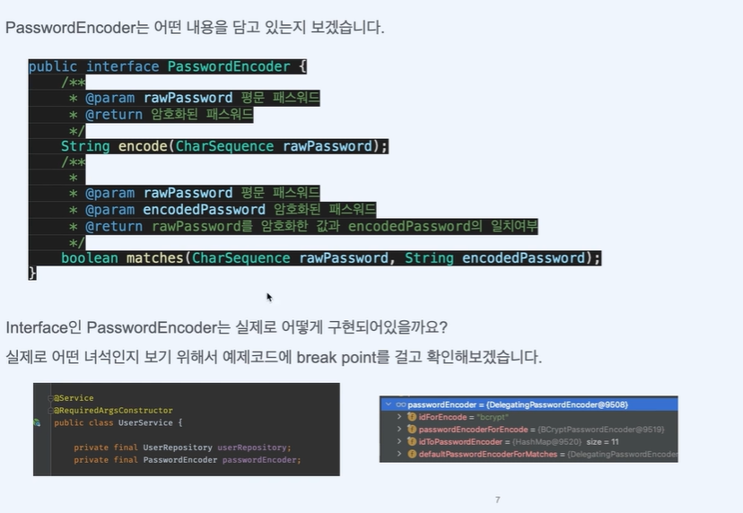
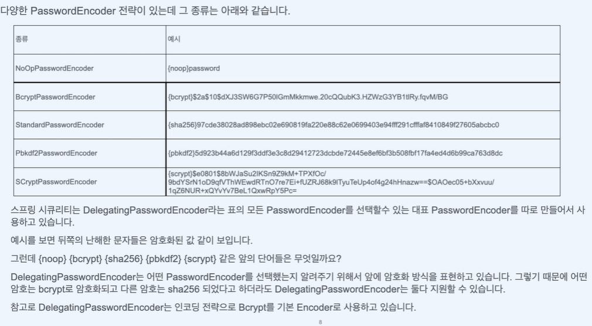

# PasswordEncoder
    
password를 안전하게 관리하자

    우리는 Spring Security를 사용하면서 유저의 Password를 관리해야할 필요가 있습니다.  
    Password를 관리할 때는 일단 두가지가 만족되어야 합니다.   
    1. 회원가입할 때 Password를 입력받으면 그 값을 암호화해서 저장해야 합니다.   
    2. 로그인할 때 입력받는 Password와 회원가입할 때의 Password를 비교할 수 있어야합니다.  
    
    이 두가지를 만족하기 위해서는 보통 해시 함수라는 알고리즘 방식을 이용합니다.    
    해시 함수는 암호화는 비교적 쉽지만 복호화가 거의 불가능한 방식의 알고리즘입니다.
    이것을 사용하면 아래와 같은 방식으로 Password를 관리할 수 있습니다.
    1. 회원가입할때 password를 해시함수로 암호화해서 저장합니다.
    2. 로그인할 때 password가 들어오면 같은 해시함수로 암호화합니다.
    3. 저장된 값을 불러와서 2번의 암호화된 값과 비교합니다.
    4. 동일하면 같은 암호로 인지합니다.

### passwordEncoder 종류

 
    NoOpPasswordEncoder
   
    
    암호화하지 않고 평문으로 사용합니다.   
    password가 그대로 노출되기 때문에 현재는 deprecated 되었고 사용하지 않기를 권장합니다.

 
    BcrtptPasswordEncoder
   

    Bcypt 해시 함수를 사용한 PasswordEncoder입니다.   
    Bcypt는 애초부터 패스워드 저장을 목적으로 설계되었습니다   
    password를 무작위로 여러번 시도하여 맞추는 해킹을 방지하기 위해 암호를 확인할 때 의도적으로 느리게 설정되었습니다.   
    BcrtptPasswordEncoder는 강도를 설정할 수 있는데 강도가 높을수록 오랜 시간이 걸립니다.

 
    Pbkdf2PasswordEncoder
   

    Pbkdf2는 NIST(National Institute of Standards and Technology 미국표준기술연구소)에 의해서 승인된 알고리즘이고, 미국 정부 시스템에서도 사용합니다.

 
    ScryptPasswordEncoder
   
    
    Scrypt는 Pbkdf2와 유사합니다.
    해커가 무작위로 password를 맞추려고 시도할 때 메모리 사용량을 늘리거나 반대로 메모리 사용량을 줄여서   
    느린 공격을 실행할 수 밖에 없도록 의도적인 방식을 사용합니다.
    따라서 공격이 매우 어렵고 Pbkdf2보다 안전하다고 평가받습니다.   
    보안에 아주 민감한 경우에 사용할 수 있습니다.