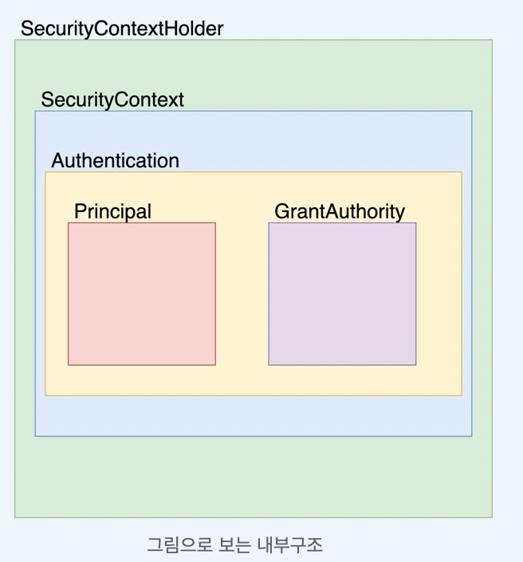
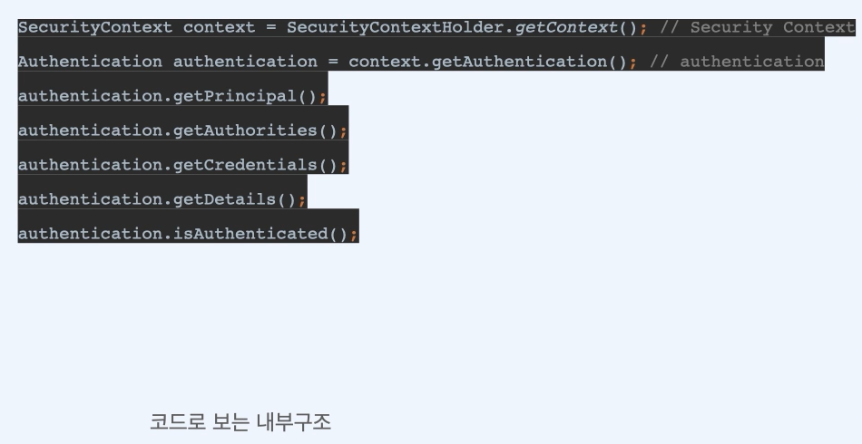
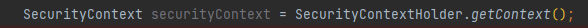
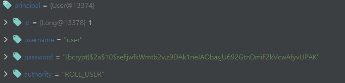
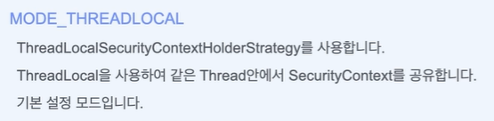
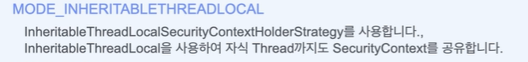
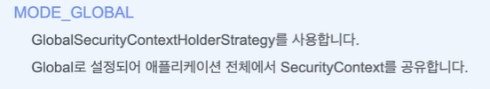
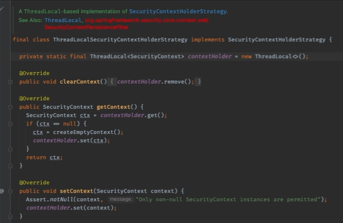

# Spring Security의 내부 구조

SecurityContextHolder -> SecurityContext -> Authentication -> Principal -> GrantAuthority

## Spring Security의 내부구조
 
    SecurityContextHolder   
   

    SecurityContextHolder는 SecurityContext를 제공하는 static 메소드(getContext)를 지원합니다

 
    SecurityContext
   

    SecurityContext는 접근 주체와 인증에 대한 정보를 담고 있는 Context입니다.   
    즉,Authentication을 담고 있습니다.

 
    Authentication   
   

    Principal과 GrantAuthority를 제공합니다.   
    인증이 이루어 지면 해당 Athentication이 저장됩니다.

 
    Principal   
   
    
    유저에 해당하는 정보입니다.
    대부분의 경우 Principal로 UserDerails를 반환합니다.

 
    GrantAuthority   
   

    ROLE_ADMIN, ROLE_USER등 Principal이 가지고 있는 권한을 나타냅니다.
    prefix로 'ROLE_' 이 붙습니다.
    인증 이후에 인가를 할 때 사용합니다.
    권한은 여러개 일 수 있기 때문에 Collection<GrantedAuthority>형태로 제공합니다.
    ex) ROLE_DEVELOPER, ROLE_ADMIN

# ThreadLocal
우리가 
   
이곳에  아무인자도 주지 않고 그냥 선언만 했을 뿐인데

디버깅을 해 해당부분을 돌려본 순간

이렇게 시큐리티가 정보를 가져가는 것을 볼 수가 있다. 

이런 상황이 가능하게 해주는 것이 바로 ThreadLocal이라는 클래스가 자동으로 작동하기 떄문이다

우리가 WebMVC 기반으로 프로젝트를 만든다는 가정하에 대부분의 경우에는 요청 1개에 Thread 1개가 생성됩니다.
   
이때 ThreadLocal을 사용하면 Thread마다 고유한 공간을 만들수가 있고 그곳에 SecurityContext를 저장할 수 있습니다.
   
그러나 ThreadLocal만 강제로 사용해야하는 것은 아니며 원하면 SecurityContext 공유 전략을 바꿀 수 있습니다.

------
Spring Security의 기본적인 Security Context 관리 전략은 ThreadLocal을 사용하는   
ThreadLocalSecurityContextHolderStrategy 입니다.

변수는 지역변수, 전역변수와 같은 유효한 Scope를 가집니다. 마찬가지로 ThreadLocal은 Thread마다 고유한 영역을 가지고 있는
곳에 저장된 변수로 각각의 Thread안에서 유효한 변수이다. 일반적으로 서버의 경우에는 외부로부터 요청이 오면 그 요청마다 Thread 1개가 할당된다. 따라서 ThreadLocal로 securityContext를 관리하게 되면 SecurityContext는 요청마다 독립적으로 관리될 수있다.

