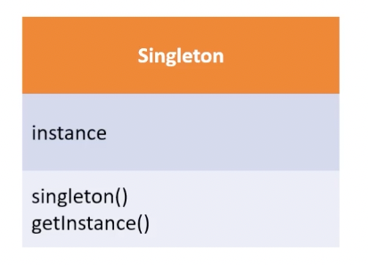
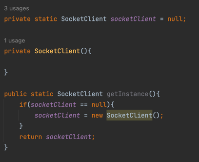

# Singleton pattern

Singleton Pattern 패턴은 어떠한 클래스(객체)가 유일하게 1개만 존재 할 떄 사용한다.

이를 주로 사용하는 곳은 서로 자원을 공유 할 떄 사용하는데, 실물 세계에서는 프린터가 해단되며,   
실제 프로그래밍에서는 TCP socket통신에서 서버와 연결된 connect 객체에 주로 사용한다

싱글톤 디자인 패턴은 몇가지의 특징이 나타난다
1. 싱글톤은 자기 자신을 객체로 가지고 있어야 한다.
2. 싱글톤은 기본 성성자를 private로 막아야한다.
3. 싱글톤은 get매서드로 객체가 null일때만 생성이 가능하게 만들어야한다.

