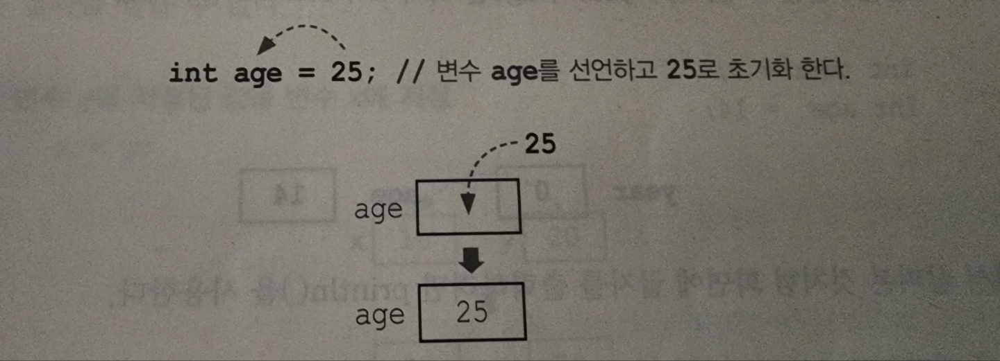
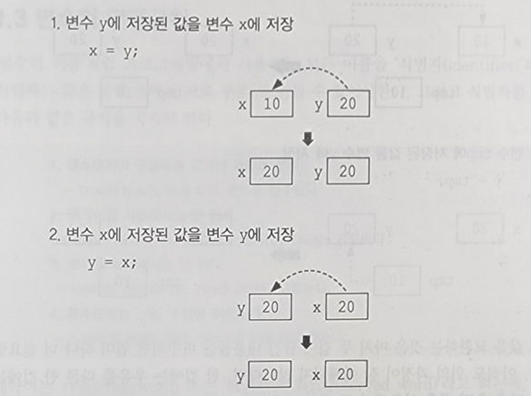
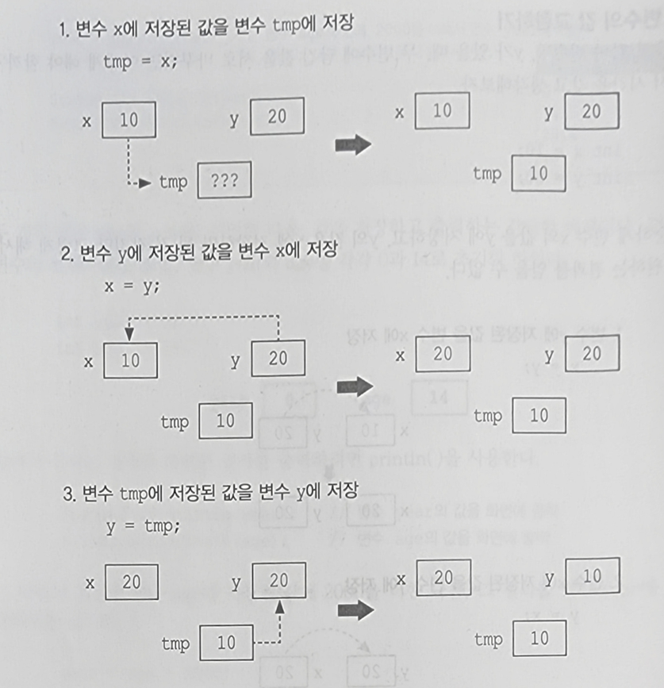
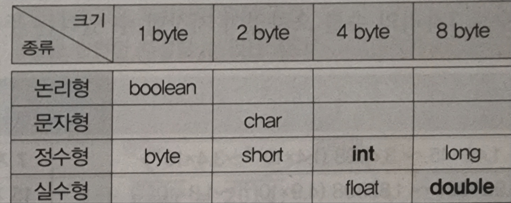
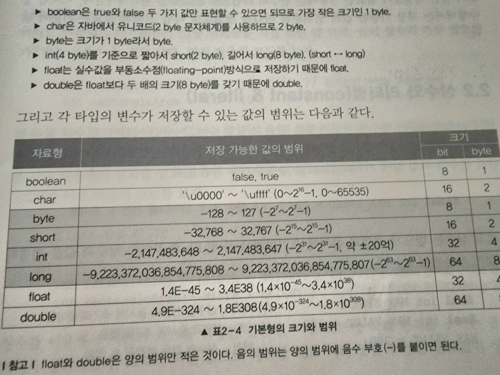

# 변수란?
- 수학적 의미: '변수變數'를 '변하는 수'
- 프로그래밍적 의미: 변수(variable)란, 값을 저장 할 수 있는 메모리상의 공간을 의미
    - 이 공간에 저장된 값은 변경 될 수 있어 변수라는 수학적 정의와 상통한다.

- #### 하나의 변수에는 단 하나의 값만 저장할 수 있다.
  - 새로운 값을 저장하면 이전의 값은 사라진다.

## 변수의 선언과 초기화
변수를 사용하려면 먼저 변수를 초기화 해야 한다.
```java
 int age; //age라는 이름의 변수를 선언
```
1. 변수 타입 설정
2. 변수 이름 설정

변수의 사용은 변수 이름으로 사용하게 된다.

### 변수 초기화
변수를 사용하려면 반드시 '초기화(initialization)'해야한다. 메모리는 여러 프로그램이 공유하는 자원이므로
전에 다른 프로그램에 의해 저장된 '알 수 없는 값(쓰레기값 garbage value)'이 남아있을 수 있기 때문

변수를 초기화 할때는 '='대입 연산자를 사용한다.   

'='의 의미
- 수학적 의미: 양변이 같다
- 프로그래밍적 의미 : 오른쪽 값은 왼쪽 변수에 저장하라 

ex)
```java
int age = 25;
```



```java
int a;
int b;
int x =0;
int y = 0;
```

```java
int a , b;
int x = 0 , y = 0;
```

위 아래 코드는 모두 같은 코드이다.


### 두 변수의 값 교환하기
다음과 같은 x,y 두 변수 가 있을때 두 변수의 값을 바꿀려면 어떻게 할까?

```java
int x = 10;
int y = 20;
```


위 그림처럼 하면 변수는 모두 같은 값으로 변하게 될것이다. 이미 x 값은 y로 바뀌었기 때문에 이전의 x 값은 존재하지 않기 때문이다.

위 방법 말고 우리는 임시 변수를 만들어 값을 할당하고 사용한다
```java
int x = 10;
int y = 20;
int tmp;
```




두변수는 값을 교환하는 것은 마치 두 컵에 담긴 내용뮬을 바꾸려면 컵이 하나 더 필요한 것과 같다.

## 변수의 명명규칙

> 프로그래밍에서 사용하는 모든 이름을 '식별자(identifier)'라 칭한다
> 식별자는 같은 영역 내에서 서로 구분 될 수 있어야 한다.

식별자를 만들때는 반드시 아래의 규칙을 지켜야한다.

> 1. 대소문자가 구분되며 길이에 제한이 없어야 한다
>   - True와 true는 서로 다른 것으로 간주한다
> 2. 예약어를 사용해서는 안된다
>    - true는 예약어라서 사용할 수 없지만, True는 가능하다
> 3. 숫자로 시작해서는 안된다.
>    - top10은 가능자만 7up은 허용되지 않는다.
> 4. 특수문자는 '_'와 '$'만 허용한다
>    - $harp은 허용되지만, S#arp은 허용하지 않는다 

예약어는 키워드 또는 리져브드 워드(reserved word) 라고한다.

-------
### 예약어 종류
<table style="text-align: center">
<tr>
<td>absteact</td>
<td>default</td>
<td>if</td>
<td>package</td>
<td>this</td>
</tr>
<tr>
<td>assert</td>
<td>do</td>
<td>goto</td>
<td>private</td>
<td>throw</td>
</tr>
<tr>
<td>boolean</td>
<td>double</td>
<td>implements</td>
<td>protected</td>
<td>throws</td>
</tr>
<tr>
<td>break</td>
<td>else</td>
<td>import</td>
<td>public</td>
<td>transient</td>
</tr>
<tr>
<td>byte</td>
<td>enum</td>
<td>instanceof</td>
<td>return</td>
<td>true</td>
</tr>
<tr>
<td>case</td>
<td>extends</td>
<td>int</td>
<td>short</td>
<td>try</td>
</tr>
<tr>
<td>catch</td>
<td>false</td>
<td>interface</td>
<td>static</td>
<td>void</td>
</tr>
<tr>
<td>char</td>
<td>final</td>
<td>long</td>
<td>strictfp</td>
<td>volatile</td>
</tr>
<tr>
<td>class</td>
<td>finally</td>
<td>native</td>
<td>super</td>
<td>while</td>
</tr>
<tr>
<td>const</td>
<td>float</td>
<td>new</td>
<td>switch</td>
</tr>
<tr>
<td>continue</td>
<td>for</td>
<td>null</td>
<td>synchronized</td>
</tr>
</table>

-------

> 1. 클래스 이름의 첫 글자는 항상 대문자로 한다.
>   - 변수와 메서드의 이름의 첫 글자는 항상 소문자로 한다.
> 2. 여러 단어로 이루어진 이름은 단어의 첫 글자를 대문자로 한다.
>    - lastIndexOf, StringBuffer
> 3. 상수의 이름은 모두 대문자로 한다. 여러 단어로 이루어진 경우 '_'로 구분한다.
>   - PI,MAX_NUMBER

위의 규칙들은 반드시 지켜져야 하는건 아니지만 개발자의 암묵적인 룰로 정해져 내려온다.

나만의 규칙을 만들시 모든 파일의 명명 규칙을 일관되게 해야 한다.

--------

## 2. 변수의 타입
변수 타입은 크게 문자 , 숫자로 나눌 수 있다.

이 변수의 타입을 자세히 공부해 본다.

----------
### 기본형과 참조형
 > #### 기본형(primitive type)
>   - 논리형(boolean),문자형(char),정수형(byte,short,int,long),실수형(float,double)    계산을 위한 실제 값을 저장한다. 모두 8개
> #### 참조형(reference type)
>   - 객체의 주소를 저장한다. 8개의 기본형을 제외한 나머지 타입

Java는 C언어와 다르게 참조형은 변수간의 연산을 할 수 없다 -> 실제 연산에 사용되는 변수는 모두 기본형

#### 참조형 변수를 선언하는 방법
> #### 클래스이름 변수이름; // 변수의 타입이 기본형이 아닌 것들은 모두 참조변수이다.
>예시
>> Date today = new Date(); // Date객체를 생성해서, 그 주소를 today에 저장

------
### 2.1 기본형(primitive type)
<table>
  <tr>
    <th style="background: black">분류</th>
    <th style="background: black">타입</th>
  </tr>
  <tr>
    <td rowspan="2">논리형</td>
    <td>boolean</td>
  </tr>
  <tr>
    <td>true와 false 중 하나를 값으로 갖으며, 조건식과 논리적 계산에 사용된다.</td>
  </tr>
  <tr>
    <td rowspan="2">문자형</td>
    <td>char</td>
  </tr>
  <tr>
    <td>문자를 저장하는데 사용되며, 변수에 하나의 문자만 저장 가능</td>
  </tr>
  <tr>
    <td rowspan="2">정수형</td>
    <td>byte, short, int , long</td>
  </tr>
  <tr>
    <td>정수를 저장하는데 사용되며, 주로 int가 사용된다. byte는 이진 데이터를 다룰 때 사용되며, <br> short는 C언어와의 호환을 위해서 추가 되었다.</td>
  </tr>
  <tr>
    <td rowspan="2">실수형</td>
    <td>float, double</td>
  </tr>
  <tr>
    <td>실수를 저장하는데 사용되며, 주로 double이 사용된다.</td>
  </tr>
</table>

위 와 같이 정의되며 문자형인 char는 문자를 내부적으로 정수(유니코드)로 저장하기 때문에 정수형과 별반 다르지 않다.

boolean을 제외한 나머지 7개의 기본형은 서로 연산과 변환이 가능하다.

정수는 가장 많이 사용되므로 타입을 4가지나 제공한다. 각 타입마다 저장할 수 있는 값의 범위가 다르므로 저장할 값의 범위에 맞는 타입을 선택 하면 된다.


#### 각 타입이 저장할 수 있는 값의 범위



> int 범위 계산 예시
>> 2¹0 = 1024 = 10³0, 231= 2¹0x2¹0 x 2¹0 x2 = 1024x1024x1024x2 = 2×10⁹

-------
## 2.2 상수와 리터럴(constant & literal)

### 상수
- #### 상수: 변수와 같이 값을 저장할 수 있는 공간이지만 한번 값을 지정하면 변경 할 수 없다.

#### 상수 선언 방법
> final 변수타입 변수이름 = 값

상수의 이름은 무조건 대문자가 암묵적인 룰

### 리터럴
- #### 리터럴: 상수값들이지만 그 값들을 이름 자체로 정의해 버린 상수 ex) π 등

#### 예시
> final 변수타입 상수 = 리터럴

라고 생각하면 될거 같다

### 상수를 쓰는 이유
  리터럴로 그냥 공식을 구해 버리면 항상 수정이 필요할때는 그 값을 썼던 모든 리터럴 값을 변경이 필요 할 것이다.
하지만 상수를 사용하면 한상 같은 값을 가지고 있는 변수가 생겨 그 변수만 바꾸어 주면 고정된 값들을 얻을 수 있을 것이다.

### 리터럴의 타입과 접미사

- 논리형: false, true -> 접미사 없음
- 정수형: 123, 0b0101, 077, 0xFF,100L -> L
- 실수형: 3.14, 3.0e8, 1.4f,0x1,0p-1 -> f,d
- 문자형:'A', '1','\n' -> 없음
- 문자열: "ABC","123","A","true" -> 없음

JDK1.7부터 정수형 리터럴에 _ 구분자 사용가능 ex) 100_000_000_000L


### 타입의 불일치

리터널 타입과 저장될 변수 타입은 일치하는게 정상 하지만 넓은 변수 타입에 좁은 리터널값 저장 가능
- int -> int (o)
- int -> long(o)
- float -> double(o)
- double -> float (x)
- int -> byte (x)

### 문자 리터럴 과 문자열 리터럴

- 문자 리터럴: '값'으로 싸져있는 값
  - char ch = 'J';
- 문자열 리터럴: "값"으로 싸져있는 값
  - String name = "Java";


#### 문자열 초기화
> 문자열 리터럴은 ""안에 아무런 문자도 없어도 가능 하지만 ''은 불가능
>> String str = ""; //가능   
>> char ch = ''; //불가능   
>> char ch = ' '; //공백으로 초기화   

#### 문자열의 결합
```java
String name  = "Ja" + "va";
String str = name + 8.0;
// Java8.0 출력
```

> 문자열 + 모든 타입 -> 문자열 + 문자열 -> 문자열    
> 모든 타입 + 문자열 -> 문자열 + 문자열  -> 문자열

예제는 스킵 (예제 2-3)

------

## 2.3 형식화된 출력 - printf()
> println 은 값을 변경하면서 출력할수 없다는 고정적 특성이 있다   
> 이에 다른 변수를 출력하고 싶을때 사용하는 printf() 메서드   
> printf 는 println과 달리 출력후 줄바꿈 안됨   

#### 지시자
- %b: 불리언(boolean) 형식으로 출력
- %d : 10진(decimal) 정수의 형식으로 출력
- %o : 8진(octal) 정수의 형식으로 출력
- %x, %X : 16진(hexa-decimal) 정수의 형식으로 출력
- %f : 부동 소수점(floating-point)의 형식으로 출력
- %e, %E: 지수(exponent) 표현식의 형식으로 출력
- %c: 문자(character)로 출력
- %s: 문자열(string)로 출력

## 2.4 화면에서 입력받기 - Scanner


