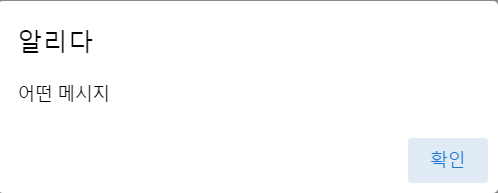
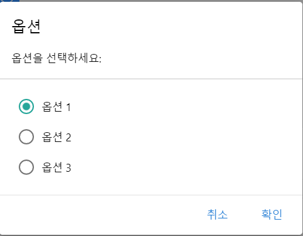

# Quasar_Dialog 란?
Quasar에서 지원하는 Dialog Plugin을 말한다. 퀘이사 홈페이지에서 확인해 보자

> Quasar Dialog는 사용자에게 특정 작업이나 작업 목록을 선택할 수 있는 기능을 제공하는 좋은 방법이다   
> 또한 사용자에게 중요한 정보를 제공하거나 결정(또는 여러 가지 결정)을 내리도록 요구 할 수 있다.   
> UI 관점에서는 DIALOG 화면의 일부만 덮는 일종의 부동 모달창으로 생각 할 수 있다.   
> 즉 DIALOG는 빠른 사용자 작업에만 사용해야 한다.

라고 나와있다.

Quasar가 제공하는 q-dialog 컴포넌트 말고 플러그인을 사용하는데에 이점은
- Vue 공간 외부에서도 호출을 할수있다.
- 템플릿을 관리할 필요가 없다
- 사용자 지정 구성요소로 Dialog를 출력 할 수 있다.
- 재활용성이 보장된다.

등이 있다.

QDialog 플러그인을 사용하면 다음과 같은 콘텐츠로 세가지 유형의 Dialog 프로그래밍 방식을 구출 할 수 있다.

1. 프롬프트 Dialog -사용자에게 입력 필드에 어떤 종류의 데이터를 입력하도록 요청합니다.
2. 라디오 단추 또는 토글(단일 선택만 해당) 또는 확인란(복수 선택용)을 사용하여 사용자가 선택할 수 있는 옵션 집합입니다.
3. 사용자가 특정 작업 또는 입력에 대해 "확인"을 취소하거나 제공할 수 있는 간단한 확인 대화 상자입니다.

이있다.


첫 번째로 이 플러그인을 사용할려면 main.js에 Dialog를 넣어 줘야 한다.
```vue
myApp.use(Quasar, {
  plugins: {
    Dialog,
  }, // import Quasar plugins and add here
});
```
이렇게 Dialog 플러그인을 사용하겠다고 표기를 해줘야 한다.

또한 이 플러그인을 사용할 페이지에 
```js
import { Dialog } from 'quasar'
(Object) Dialog.create({ ... })

// inside of a Vue file
import { useQuasar } from 'quasar'

setup () {
  const $q = useQuasar()
  $q.dialog({ ... }) // returns Object
}
```

를 사용하여 dialog를 제작 출력이 가능하다

## 기초적인 alert창 Dialog

가장 사람들이 많이 사용하는 Alert 창을 사용하는 Dialog를 만들어 보자

### template
```vue
<template>
  <div class="q-pa-md q-gutter-sm">
    <q-btn label="Alert" color="primary" @click="alert" />
  </div>
</template>
```
이렇게 버튼을 누르면 Alert 창이 나오게 만들어 보자

### script
```js
import { useQuasar } from 'quasar'

export default {
    setup(){
        const $q = useQuasar();
        
        const alert = () {
            $q.dialog({
                title:'Alert', // 맨위에 출력될 이름
                message:'message'. // 중간에 포함될 메세지 내용
            }).onOk(()=>{
                //Ok를 눌렀을때 실행될 함수 부분
            }).onCancel(() => {
                //취소를 눌렀을 때 실행될 함수 부분
            }).onDismiss(() => {
                //Dialog 창이 닫혔을때 실핼될 부분 (생략 가능)
            })
            
        return:{
            alert
        }
    }
```

이렇게 따로 지정 및 만들어 줄 필요 없이 사용이 가능하다


이미지를 출력시 이런 창이 뜬다

### 라디오 버튼 or 다른 토글 버튼이 있는 dialog

우리가 웹 페이지를 만들다보면 한번쯤 모달창 안에 선택해야 하는 문제가 나올 것이다.
그때 사용하는 방법일 것이다.
그중 우리는 radio 버튼을 사용해 보겠다
### template
```vue
<template>
  <div class="q-pa-md q-gutter-sm">
    <q-btn label="Radio Options" color="primary" @click="radio" />
  </div>
</template>
```

### script
```js
import { useQuasar } from 'quasar'

export default {
  setup () {
    const $q = useQuasar()

    function radio () {
      $q.dialog({
        title: 'Options',
        message: 'Choose an option:',
        options: {
          type: 'radio',
          model: 'opt1',
          // inline: true
          items: [
            { label: 'Option 1', value: 'opt1', color: 'secondary' },
            { label: 'Option 2', value: 'opt2' },
            { label: 'Option 3', value: 'opt3' }
          ]
        },
        cancel: true,
        persistent: true
      }).onOk(data => {
        // console.log('>>>> OK, received', data)
      }).onCancel(() => {
        // console.log('>>>> Cancel')
      }).onDismiss(() => {
        // console.log('I am triggered on both OK and Cancel')
      })
    }

    return { radio }
  }
}
```
를 사용해 출력이 가능하다

### 결과 화면



### 커스텀한 Dialog 
우리는 평생 Quasar 프레임워크가 만들어낸 UI_DIALOG만 사용하지 않을 것이다.(아마도)

그때가 되면 우리는 우리가 만든 DIALOG를 사용해야 할 지도 모른다 그때가 오면 이렇게 작성해 보자
#부모
```js
import EditMenuVue from '../components/modal/EditMenu.vue';
import { useQuasar } from 'quasar';
export default {
    setup() {
        const $q = useQuasar();
        const db = () => {
            $q.dialog({
                component: EditMenuVue,
                parent: this,
                componentProps: {
                    menuData: menuData,
                    com: true,
                },
            })
                .onOk((menuData) => {
                    console.log('OK');
                    console.log(menuData);
                    const param = {
                        MENU_LABEL: menuData.label,
                        MENU_ICON: menuData.icon,
                        MENU_SEQ: menuData.seq,
                        MENU_SEPARATOR: menuData.sep,
                        MENU_NUM: menuData.num,
                        MENU_PATH: menuData.path,
                    };
                    callUrl('/menuSave', param)
                        .then((response) => {
                            list.menuList = response.data;
                            router.go();
                        })
                        .catch(function (error) {
                            console.log(error);
                        });
                })
                .onCancel(() => {
                    console.log('Cancel');
                })
                .onDismiss(() => {
                    console.log('Called on OK or Cancel');
                });
        };
    }
}
```
이런 방식으로 내가 만든 dialog 컴포넌트를 적용시킬수가 있다

그럼 자식 컴포넌트 쪽을 확인해 보자

### 자식
```vue
<template>
  <q-dialog @hide="onDialogHide" ref="dialogRef">
    <q-card style="width: 400px">
      <div style="text-align: center">
        <h5>메뉴 생성</h5>
      </div>
      <div class="q-pa-md">
        <div class="q-gutter-md" style="max-width: 300px; margin: auto">
          <q-input
            v-model="$props.menuData.label"
            label="메뉴라벨"
            clearable
            hint="첫글자 대문자"
          />
          <q-input
            v-model="$props.menuData.icon"
            label="메뉴아이콘"
            clearable
          />
          <q-input label="경로" clearable v-model="$props.menuData.path" />
          <div class="q-gutter-sm">
            <q-radio v-model="$props.menuData.sep" val="true" label="사용" />
            <q-radio v-model="$props.menuData.sep" val="false" label="미사용" />
          </div>
        </div>
        <q-card-section
          class="row q-gutter-sm"
          style="margin: auto; width: 300px"
        >
          <q-btn
            label="생성"
            color="primary"
            icon-right="edit"
            @click="onOKClick"
          >
          </q-btn>
          <q-btn
            label="취소"
            color="primary"
            v-close-popup
            icon-right="close"
          />
        </q-card-section>
      </div>
    </q-card>
  </q-dialog>
</template>
```
```js
<script setup>
import { useDialogPluginComponent } from 'quasar';

const props = defineProps({
  com: {
    module: 'false',
    type: Boolean,
  },
  menuData: {
    module: Object,
  },
});
defineExpose({
  props,
});
defineEmits([
  // REQUIRED; need to specify some events that your
  // component will emit through useDialogPluginComponent()
  ...useDialogPluginComponent.emits,
]);

const { dialogRef, onDialogHide, onDialogOK, onDialogCancel } =
  useDialogPluginComponent();
// dialogRef      - Vue ref to be applied to QDialog
// onDialogHide   - Function to be used as handler for @hide on QDialog
// onDialogOK     - Function to call to settle dialog with "ok" outcome
//                    example: onDialogOK() - no payload
//                    example: onDialogOK({ /*...*/ }) - with payload
// onDialogCancel - Function to call to settle dialog with "cancel" outcome

// this is part of our example (so not required)
function onOKClick() {
  // on OK, it is REQUIRED to
  // call onDialogOK (with optional payload)
  onDialogOK(props.menuData);
  // or with payload: onDialogOK({ ... })
  // ...and it will also hide the dialog automatically
}
</script>
```

이런 방식으로 불러올 수있다

defineProps란 〈script setup〉 에서 지원하는 props를 바로 받아서 사용하게 해주는 함수이다. 
